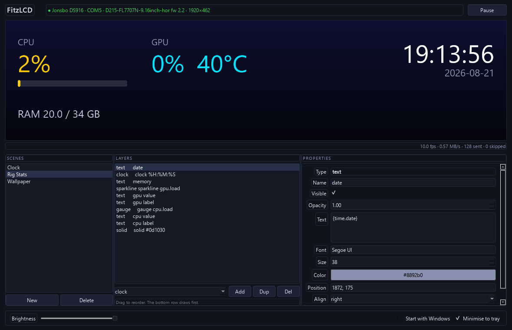
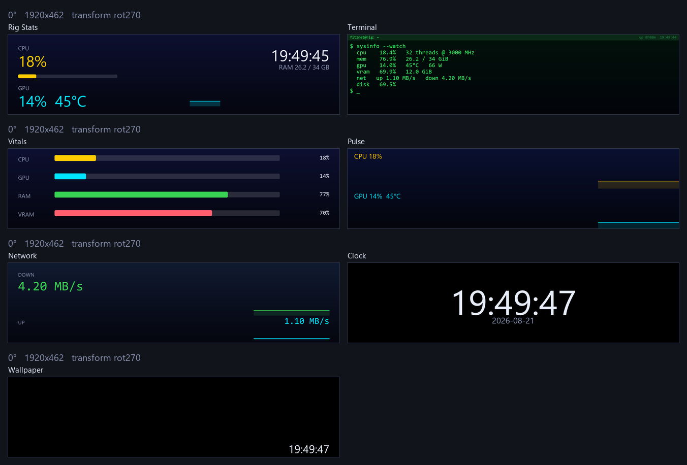
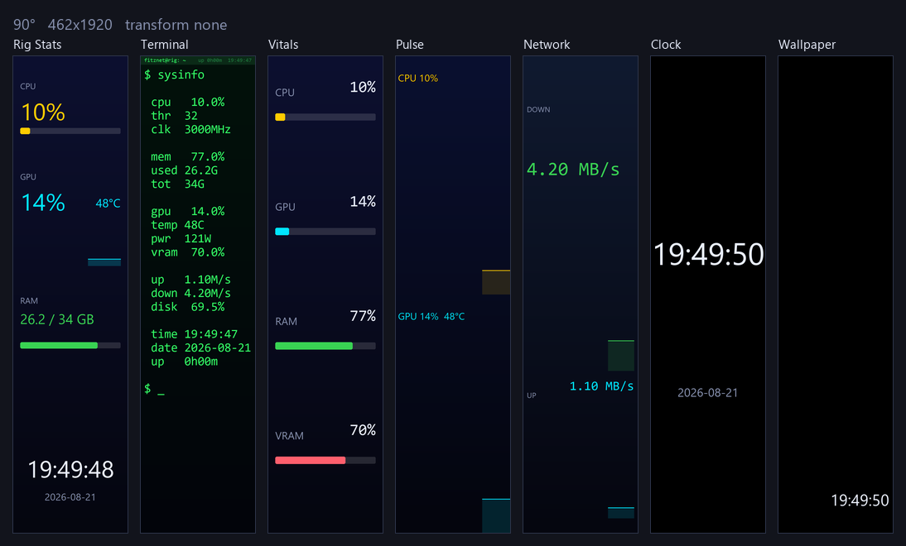

# FitzLCD

A desktop app for driving PC-case USB LCD panels with your own content — images,
GIFs, video and live system stats — without the vendor's software.

Built for the **Jonsbo DS916** ("Jungle Leopard") 9.16" 1920×462 panel
(USB `33C3:7788`), on a pluggable driver architecture so other panels can be
added without touching anything above the driver layer.



## What it does

- **Autodetects** the panel by USB VID:PID and confirms it with the device's own
  `getDeviceInfo` handshake — no port to configure by hand.
- **Any orientation.** Mount the panel at 0°, 90°, 180° or 270°; scenes are
  composed in what you actually see and the output transform follows.
- **Composes scenes** from a stack of layers: media (image / GIF / video), text
  with live `{cpu.load:.0f}` style metric tokens, bar gauges, ring gauges,
  sparklines, a clock, solid/gradient fills, and a spark mark.
- **Nine built-in scenes** including a monospace terminal readout, flipped
  through by hand or on a timer.
- **Live system data** from psutil and NVML: CPU, memory, disk, network, and GPU
  load / temperature / VRAM / power.
- **Runs in the tray** with optional start-with-Windows, so the panel stays live
  when the window is closed.
- **Works without hardware** via a built-in virtual panel, so you can develop,
  debug and screenshot the whole app with nothing plugged in.

## Scenes at a glance

Landscape (1920×462):



The same scenes with the panel mounted on its side (462×1920):



| Scene | What it shows |
|---|---|
| **Rig Stats** | CPU and GPU headline figures, gauges, memory, clock |
| **Terminal** | A monospace console readout of every metric |
| **Vitals** | Four labelled bars: CPU, GPU, RAM, VRAM |
| **Pulse** | Full-bleed CPU and GPU history graphs |
| **Network** | Up/down throughput with rolling graphs |
| **Clock** | Big centred time and date |
| **Wallpaper** | Your image, GIF or video with a clock over it |
| **CS2 HUD** | Live Counter-Strike 2 match state via Game State Integration |
| **Claude Usage** | Claude Code session and weekly limit rings, tokens and cost, in Claude's own colours |

## Quick start

```powershell
python -m venv .venv
.\.venv\Scripts\python.exe -m pip install -e ".[dev]"
.\.venv\Scripts\python.exe -m fitzlcd
```

Useful flags:

```powershell
python -m fitzlcd --list-panels           # what can I see?
python -m fitzlcd --panel virtual         # run with no hardware attached
python -m fitzlcd --headless --scene Clock  # no GUI
```

## Scenes

Scenes are JSON in `%APPDATA%\FitzLCD\scenes\`, editable in the GUI or by hand:

```json
{
  "name": "Rig Stats",
  "fps": 10,
  "background": "#05060f",
  "layers": [
    { "type": "media", "source": "C:/media/loop.gif", "fit": "cover", "pan": 0.5 },
    { "type": "text", "text": "CPU {cpu.load:.0f}%", "size": 92,
      "pos": ["3%", "20%"], "color": "#ffcc00" },
    { "type": "gauge", "metric": "gpu.temp", "rect": ["3%", "50%", "42%", 26],
      "maximum": 100 },
    { "type": "clock", "pos": ["-3%", "12%"], "anchor": "top-right", "align": "right" }
  ]
}
```

Layers draw bottom-up: the first entry is the backdrop.

### Positioning that survives rotation

Every coordinate is a *length*, and the forms can be mixed freely:

| Value | Meaning |
|---|---|
| `40` | 40 px from the left/top edge |
| `-40` | 40 px in from the right/bottom edge |
| `"50%"` | half way across that axis |
| `"-10%"` | 10% in from the far edge |
| `"center"` | centred on that axis |

`anchor` picks which corner a layer measures from — `top-left` (default),
`top-right`, `bottom-center`, `middle-center` and the rest. Anchor a layer to the
edge it should hug and give it percentages, and it lands in the same visual place
whichever way the panel is turned.

Font sizes stay in pixels on purpose: the panel is one physical device being
rotated, so a 92 px glyph is the same physical size either way. Text also shrinks
itself when a line would not fit (`"fit": false` turns that off).

When an arrangement genuinely cannot work both ways — a wide terminal readout
will not fit a 462 px column at a readable size — tag the alternatives with
`"orientation": "landscape"` or `"portrait"` and only the matching one is drawn.
That is how the Terminal, Rig Stats and Vitals scenes carry two layouts in one
file.

### Flipping through scenes

Prev/Next in the scenes pane or the tray menu, and a **Cycle** interval that
advances automatically. Set it to `off` to leave the panel on one scene.

### 12- or 24-hour clocks

**12-hour clock** in the footer switches every clock in the app between
`13:30:00` and `1:30:00 PM`, live — no restart. It drives the `{time.now}`
metric and every `clock` layer whose **Format** box is blank.

Blank means "follow this setting". Typing an explicit strftime pattern into a
clock layer — `%H:%M`, `%I:%M %p`, `%A` — is a deliberate per-scene choice and
overrides the preference, so a scene that wants one particular format keeps it
whichever way the toggle is set. The setting persists as `clock_24_hour` in
`config.json`.

### Metric tokens

`cpu.load` `cpu.freq` `cpu.cores` · `mem.used_pct` `mem.used_gb` `mem.total_gb` ·
`gpu.load` `gpu.temp` `gpu.vram_pct` `gpu.vram_used_gb` `gpu.power` `gpu.name` ·
`net.up` `net.down` `disk.used_pct` · `time.now` `time.date` `time.uptime`

A metric with no value renders as `—` rather than failing the frame. CPU
temperature is not exposed by psutil on Windows, so `cpu.temp` needs the optional
LibreHardwareMonitor provider (not enabled by default — it wants admin rights).

#### Claude Code usage

Two separate sources, and the difference matters:

`claude.today.tokens` `claude.today.cost_usd` `claude.today.messages`
`claude.today.sessions` `claude.week.*` `claude.total.*` `claude.model` are added
up from the transcripts Claude Code writes under `~/.claude/projects`. They cover
**this machine only**, and `cost_usd` is a notional list-price estimate — most
Claude Code usage is billed against a subscription, not per token.

`claude.limits.session.pct` and `claude.limits.week.pct` (plus `.resets_in`,
`.resets_text`, and `claude.limits.week_sonnet.pct` / `week_opus.pct`) are the
real server-side utilisation percentages — the same numbers `/usage` shows —
fetched from the endpoint `/usage` itself queries, using the OAuth token Claude
Code already stores locally. Fetching them is a metadata call and costs no tokens.

That endpoint is **undocumented and throttles hard**, so the provider polls every
5 minutes (never below 3), caches to disk across restarts, and backs off on 429.
Disable it with `claude_limits_enabled: false` in `config.json`. When it cannot
get a reading, `claude.limits.status_text` explains why (`NOT SIGNED IN`,
`RATE LIMITED`, `STALE`, `OFFLINE`) and the percentages stay absent rather than
showing a misleading zero.

### Fit modes

The panel is 4.16:1 and nearly all source media is 16:9, so `fit` matters:
`cover` (fill and crop), `contain` (letterbox), `stretch`, `tile`, `none`. Use
`pan` / `pan_x` (0.0–1.0) to choose which part of the source survives the crop.

## Development

The IntelliJ project ships with run configurations for everything:

| Configuration | What it does |
|---|---|
| `App: FitzLCD` | Run against the real panel |
| `App: FitzLCD (virtual panel)` | **Run/debug with no hardware** |
| `App: FitzLCD (headless)` | No GUI |
| `App: FitzLCD (virtual, portrait)` | Same, mounted at 90° |
| `Probe: detect` / `info` / `push image` / `bench` / `brightness` | Talk to the panel directly |
| `Tests: all` | pytest |
| `Lint: ruff` / `Format: black` | Style |
| `UI: screenshot` / `UI: screenshot (portrait)` | Render the real window offscreen to a PNG |
| `Scenes: contact sheet` | Every scene at every orientation, in one image |
| `Check: all` / `Check: all (fix)` | Format check + lint + tests in one process |
| `Build: PyInstaller` | Standalone build into `dist/FitzLCD/` |

All are ordinary Python configurations, so the Debug button gives you breakpoints
in the render loop, the engine thread and the serial driver.

```powershell
.\.venv\Scripts\python.exe tools/check.py         # everything
.\.venv\Scripts\python.exe tools/ui_shot.py       # screenshot the GUI
.\.venv\Scripts\python.exe tools/scene_sheet.py   # every scene, every orientation
```

`tools/scene_sheet.py` is the fastest way to see whether a layout change holds up:
it renders the whole library at 0/90/180/270° into one contact sheet, with no
hardware involved.

### Releases

Every push and PR to `main`/`master` runs lint + tests via
[`python-build.yaml`](.github/workflows/python-build.yaml). Cutting a release is
manual: run the [`Publish Release`](.github/workflows/publish.yml) workflow from
the Actions tab, pick `major` / `minor` / `patch`, and it bumps the version in
`pyproject.toml` **and `src/fitzlcd/__init__.py`**, tags it, builds the
PyInstaller EXE from that tag, and attaches `FitzLCD-<version>-windows.zip` to a
new GitHub Release.

The bump happens *before* the build on purpose: `__version__` is baked into the
binary and is what the in-app updater compares against the latest release. Build
first and you ship a binary that thinks it's the previous version and offers
itself an endless update.

## Updating

The packaged build updates itself. It asks GitHub for the latest release about
eight seconds after start-up and once a day after that; when there's a newer
one, the tray pops a notification and the footer button turns into
**Update to v1.2.0**. Click it, confirm, and FitzLCD downloads the release,
verifies it, closes, swaps itself over and starts again — a few seconds, no zip
to handle.

The swap is done by a small batch file rather than by FitzLCD itself: the build
is one-dir, so the running `FitzLCD.exe` and everything under `_internal` are
locked by Windows for as long as the app is alive. The helper waits for the
process to exit, mirrors the new build over the install directory, relaunches,
and deletes itself. If it ever goes wrong it leaves `apply.log` in
`%APPDATA%\FitzLCD\updates\`.

Two things to know:

- **Running from source?** None of this applies — the button is hidden and no
  check is made. Update with `git pull` instead.
- **Installed under `Program Files`?** FitzLCD won't try to update itself
  somewhere it can't write without elevation. It offers the release page
  instead. Keeping the app somewhere writable avoids this.

Set `"update_check_enabled": false` in `%APPDATA%\FitzLCD\config.json` to stop
the automatic checks; the button still works on demand.

## Architecture

```
sources/          media decoding, system metrics
render/           scene model, compositor, layers, geometry, JPEG encode
render/geometry   percentage/anchor length resolution
engine.py         paced render loop, dirty-frame skip, reconnect watchdog
panels/           Panel interface, registry, DS916 serial driver, virtual panel
scenes_builtin.py the seeded scene library
ui/               preview-first main window, properties pane, tray
```

Orientation is one number in two places: `PanelCaps.rotated(degrees)` swaps the
frame geometry and folds the mounting angle into the panel's own scan-out
transform (rotations about the same centre simply add), and the engine composes
at the rotated size. Whatever the mounting, the bytes reaching the panel are
always its native 462×1920 buffer.

Layers declare their own editable fields, so the properties pane is generated
rather than hand-written — a new layer type needs no UI code.

## Working with this panel safely

Two things about the DS916 firmware are worth knowing before you experiment; both
are documented in full in [the protocol spec](docs/Jonsbo_DS916_Protocol_Spec.md#8-findings-from-building-fitzlcd-2026-08-21):

- **Do not free-run frames at it.** The USB link happily accepts ~350 fps, but
  the panel does not render anywhere near that. Flooding it wedges the firmware
  until you physically power-cycle it — at which point even opening the port
  blocks forever. This driver paces frames and drops rather than queues.
- **Only one process can hold the port.** Close the vendor app (and the probe
  CLI) before running FitzLCD. Use `--panel virtual` to develop alongside them.

The OTA firmware command is deliberately not implemented.

## Licence

Personal project; no licence granted yet.
